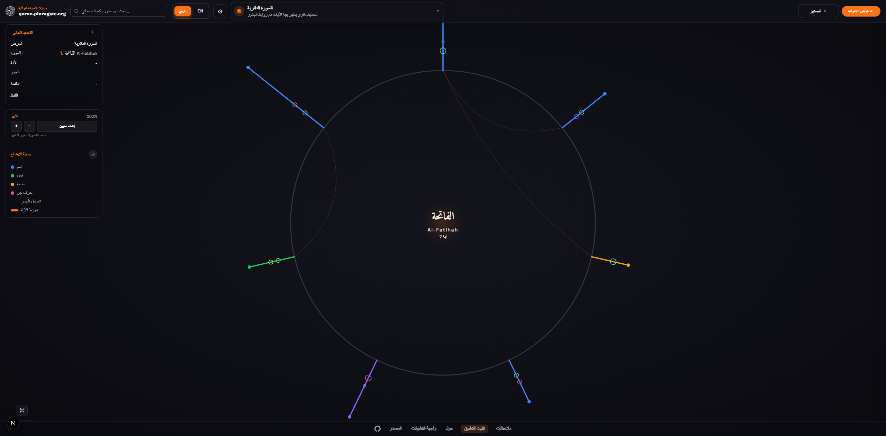
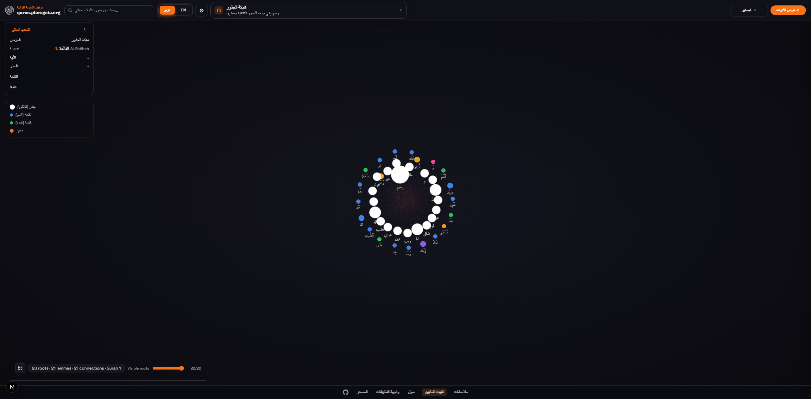
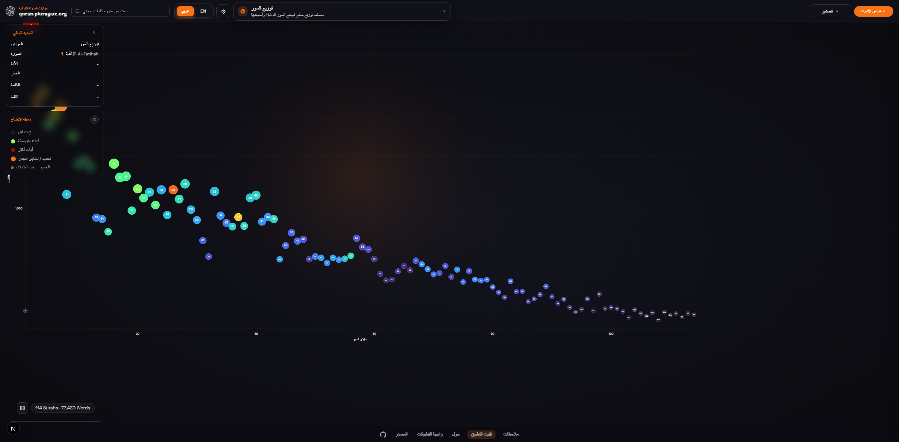
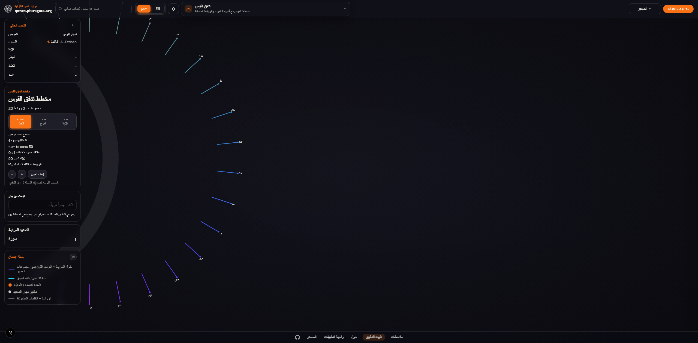
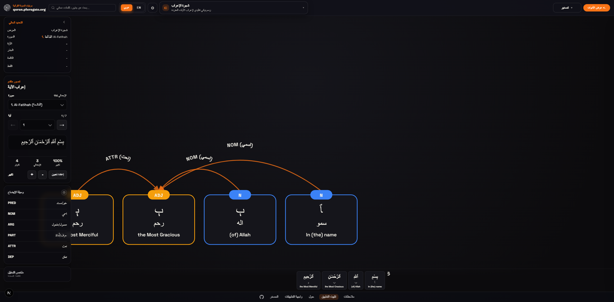
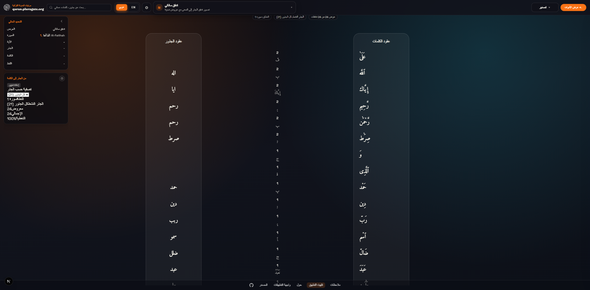
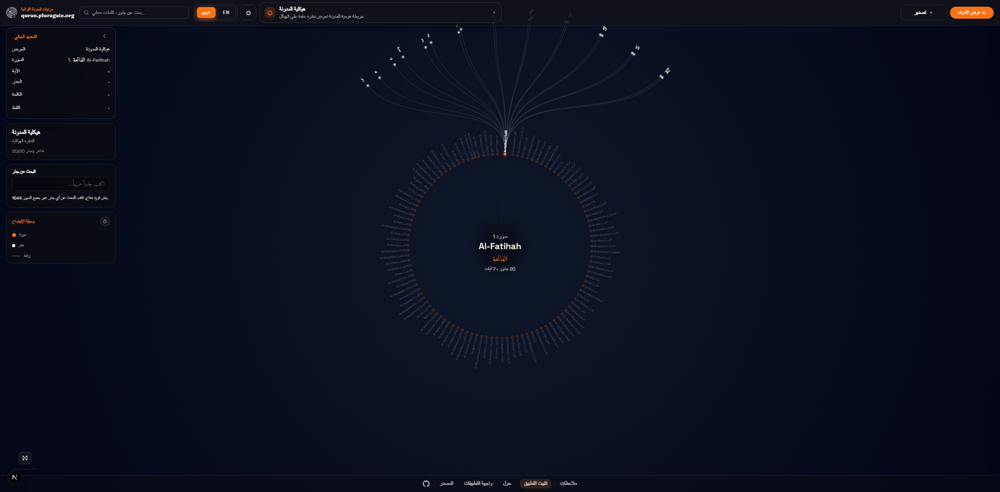
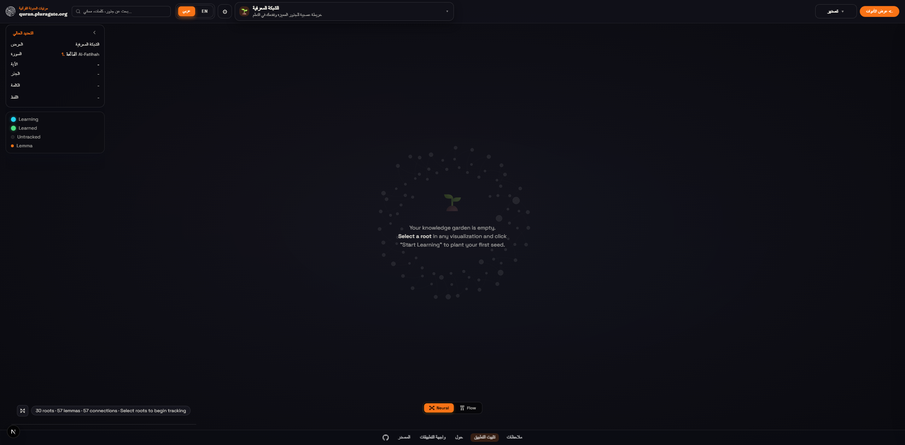

<div align="center">

# Quran Corpus Visualizer

**Interactive exploration of Quranic linguistic structure and morphology**

[](https://www.gnu.org/licenses/gpl-3.0)
[](https://nextjs.org/)
[](https://www.typescriptlang.org/)
[](https://github.com/lAvArt/Quran-corpus-visualizer/actions/workflows/ci.yml)
[](https://quran.pluragate.org)

[**Live Demo**](https://quran.pluragate.org) · [**Report Bug**](https://github.com/lAvArt/Quran-corpus-visualizer/issues/new?template=bug_report.md) · [**Request Feature**](https://github.com/lAvArt/Quran-corpus-visualizer/issues/new?template=feature_request.md)

</div>

---

<!-- GRAPH:RADIAL_SURA -->

<!-- END:GRAPH -->

A sophisticated interactive tool for exploring the linguistic and morphological structure of the Quran. Built upon the [Quranic Arabic Corpus](https://corpus.quran.com) API, this project transforms linear text into dynamic, explorable graphs.

> **If you find this project useful, please consider giving it a ⭐ — it helps others discover it!**

## Key Features

### Interactive Visualizations

- **Radial Surah Map** — Visualize the entire Quran or specific Surahs as a radial tree, highlighting relationships between Ayahs and roots.
- **Root Network Graph** — Explore the connectivity of Arabic roots across the corpus using force-directed graphs.
- **Collocation Network** — Explore semantic co-occurrence around a selected root using PMI, contextual scopes, and tertiary context nodes.
- **Knowledge Graph** — Neural-style map of your tracked roots and learning progress, with force-directed and flow layout modes.
- **Surah Distribution** — Analyze the distribution of specific roots or lemmas across all Surahs.
- **Arc Flow Diagram** — Trace the flow of roots and grammatical connections within an Ayah.
- **Ayah Dependency Graph** — Deep dive into the syntactic dependency structure of individual Ayahs.
- **Root Flow Sankey** — Track how Arabic roots flow through different grammatical forms.
- **Corpus Architecture Map** — See the structural overview of the entire corpus.

### Advanced Search & Analysis

- **Persistent Search** — Search state survives sidebar tab switches; query context is never lost.
- **Morphological Search** — Filter by Root, Lemma, Part-of-Speech (POS), or specific Ayah via the Advanced Search panel.
- **Inline Quick Search** — The Inspector tab includes a quick search bar for instant root/word lookups.
- **Mobile Search** — Floating search overlay accessible from the mobile bottom bar.
- **Root Lock** — When searching for a root, graph interactions won't override your active search context.
- **Cross-Reference** — Instantly see where else a root or word appears in the Quran.
- **Full-Text Search** — Search both Arabic text and English translations.
- **Collocation Scope Controls** — Switch between Whole Ayah Context and Nearby Words Window to compare thematic vs phrase-level proximity.

### Modern UX/UI

- **Immersive Design** — A "neural" dark mode interface designed for deep focus.
- **Unified Inspector Panel** — Morphology details and search in one tab, with Advanced Search as a dedicated secondary tab.
- **Knowledge Tracker** — Track Arabic roots as "learning" or "learned", add notes, and import/export your progress as JSON.
- **Responsive** — Fully optimized for Desktop, Tablet, and Mobile with collapsible panels and mobile search overlay.
- **Internationalization** — Full support for English and Arabic interfaces (RTL).
- **Progressive Web App (PWA)** — Installable app shell with offline-first static assets and network-first page updates.

<details>
<summary><strong>📸 More Screenshots</strong></summary>
<br/>

<!-- GRAPH:ROOT_NETWORK -->

<!-- END:GRAPH -->

<!-- GRAPH:SURAH_DISTRIBUTION -->

<!-- END:GRAPH -->

<!-- GRAPH:ARC_FLOW -->

<!-- END:GRAPH -->

<!-- GRAPH:DEPENDENCY_TREE -->

<!-- END:GRAPH -->

<!-- GRAPH:SANKEY_FLOW -->

<!-- END:GRAPH -->

<!-- GRAPH:CORPUS_ARCHITECTURE -->

<!-- END:GRAPH -->

<!-- GRAPH:KNOWLEDGE_GRAPH -->

<!-- END:GRAPH -->


</details>

## Getting Started

### Prerequisites

- Node.js 18+
- npm or yarn
- A [Supabase](https://supabase.com) project (free tier works)

### Installation

1. **Clone the repository**

    ```bash
    git clone https://github.com/lAvArt/Quran-corpus-visualizer.git
    cd Quran-corpus-visualizer
    ```

2. **Install dependencies**

    ```bash
    npm install
    ```

3. **Configure environment variables**

    ```bash
    cp .env.example .env.local
    ```

    Fill in `NEXT_PUBLIC_SUPABASE_URL` and `NEXT_PUBLIC_SUPABASE_ANON_KEY` from your Supabase project dashboard. See [DEPLOYMENT.md](DEPLOYMENT.md) for all variables.

4. **Apply database migrations**

    ```bash
    supabase db push
    ```

    Or apply `supabase/migrations/*.sql` (001 → 006) in order via the [Supabase Dashboard](https://supabase.com/dashboard) SQL editor. Requires the [Supabase CLI](https://supabase.com/docs/guides/cli).

5. **(Optional) Seed the corpus**

    ```bash
    npx tsx scripts/seed-corpus.ts
    ```

    Requires `SUPABASE_SERVICE_ROLE_KEY` in `.env.local`.

6. **(Optional) Fetch local morphology data** for offline dev

    ```bash
    npm run fetch:morphology
    ```

7. **Run the development server**

    ```bash
    npm run dev
    ```

    Open [http://localhost:3000](http://localhost:3000) with your browser to see the result.

## 🛠️ Tech Stack

- **Framework**: [Next.js 16](https://nextjs.org/) (App Router)
- **Language**: TypeScript
- **Database**: [Supabase](https://supabase.com) / PostgreSQL 17 (pgvector, pg_trgm, unaccent)
- **Visualization**: [D3.js](https://d3js.org/) for complex graphs
- **Animation**: Framer Motion
- **Styling**: Vanilla CSS
- **Internationalization**: next-intl

## Project Structure

```text
├── app/                  # Next.js App Router pages and layouts
│   ├── [locale]/         # Localized pages (en, ar)
│   └── api/              # API routes (feedback)
├── components/
│   ├── visualisations/   # D3.js visualization components
│   ├── inspectors/       # Detailed data inspection panels
│   └── ui/               # Reusable UI elements (Sidebar, Search, etc.)
├── lib/
│   ├── cache/            # IndexedDB caching (corpus + knowledge tracker)
│   ├── context/          # React context providers (Knowledge, etc.)
│   ├── corpus/           # Data loaders and types for Quranic data
│   ├── data/             # Static data (Surah names, help text)
│   ├── hooks/            # Custom React hooks (Zoom, Resize, etc.)
│   ├── schema/           # TypeScript types and validation
│   ├── search/           # Search indexing, root flows, and collocation analytics
│   └── supabase/         # Supabase client, server helpers, types, knowledge service
├── supabase/
│   └── migrations/       # PostgreSQL migrations (001–006)
├── messages/             # i18n translation files (en, ar)
├── public/               # Static assets and corpus data
├── scripts/              # Build/dev helper scripts
└── docs/                 # Project documentation
```

## Architecture Notes

- **App shell**: localized App Router pages provide the persistent shell, providers, and route-level workspaces for Explore, Search, and Study.
- **Corpus data**: Supabase is the primary production source; cached local data and sample data keep the experience resilient during cold starts and fallback conditions.
- **Search**: quick client search supports fast navigation hints, while API-backed search remains the authoritative path for semantic and relational queries.
- **Visualizations**: D3 graph components should stay isolated behind shared selection and shell state rather than owning app-wide orchestration.
- **Study/account**: authentication, tracked roots, notes, import/export, and migration flows support the main exploration experience without replacing it.

## Workspace Assumptions

- This repository is the intended Turbopack root.
- Nested projects and generated artifacts are excluded from linting and should not be treated as part of this app's source of truth.
- `npm run lint`, `npm run typecheck`, `npm test`, and `npm run build` are the expected local quality gates for this app.
- Operational release guidance lives in [docs/RELEASE_CHECKLIST.md](docs/RELEASE_CHECKLIST.md).
- Observability event coverage and review guidance live in [docs/OBSERVABILITY.md](docs/OBSERVABILITY.md).
- Phase-by-phase implementation status lives in [docs/ROADMAP_STATUS.md](docs/ROADMAP_STATUS.md).

## Release Checklist

- `npm run verify`
- `npx playwright test tests/e2e/app-smoke.spec.ts`
- `npm run test:a11y-smoke`
- `npm run build`
- Verify Explore, Search, and Study load in both desktop and mobile layouts.
- Verify shell-ready, full-corpus, fallback, and search-recovery states remain user-readable.
- Validate metadata, social cards, manifest, and localized routes against the production domain.
- Verify auth, migration, import/export, and resume-exploration flows with a real Supabase-backed environment before release.

## Observability Notes

- Client analytics now track shell-ready corpus availability, deep-corpus readiness, fallback usage, search-recovery exposure, and core interaction outcomes.
- Performance analytics currently include shell render timing and first search interaction timing across header, sidebar, mobile, and workspace search surfaces.
- Release candidates should review analytics dashboards for `corpus_shell_ready`, `corpus_deep_ready`, `corpus_fallback_used`, `search_recovery_shown`, and `performance_metric` before rollout.

## Contributing

Contributions are welcome! Please read our [Contributing Guide](CONTRIBUTING.md) before submitting a Pull Request.

See the [Roadmap](docs/ROADMAP.md) for planned features and priorities.

## Attribution & Data Sources

This project uses data and APIs from the **Quranic Arabic Corpus**, an open-source project created by **Kais Dukes** (Rahimahullah) and maintained by the community.

- **Source**: [github.com/kaisdukes/quranic-corpus](https://github.com/kaisdukes/quranic-corpus)
- **Website**: [corpus.quran.com](https://corpus.quran.com)
- **Verse API**: [api-docs.quran.com](https://api-docs.quran.com/)

We explicitly acknowledge and thank the original authors for their monumental work in digitizing and annotating the linguistic structure of the Quran.

Quran.com-derived cached corpus content in the browser is enforced with a strict **7-day TTL** and policy-version migration to keep offline data fresh and license-aligned.

## Security

Please see [SECURITY.md](SECURITY.md) for reporting vulnerabilities.

## License

This project is licensed under the **GNU General Public License v3.0 (GPL-3.0)** — see the [LICENSE](LICENSE) file for details.

This ensures that this project and any derivatives remain free and open for the benefit of the community, consistent with the upstream corpus license.

---

<div align="center">

**Built with reverence for the Quran and its linguistic heritage.**

[Live Demo](https://quran.pluragate.org) · [Documentation](docs/) · [Report Issue](https://github.com/lAvArt/Quran-corpus-visualizer/issues)

</div>
