الحمد لله الذي علّم بالقلم, علّم الإنسان ما لم يعلم, والصّلاة على خير معلّم للنّاس الخير محمّد وبعد:

فما زال السعي لتطوير مشروع [مُصوِّر القرآن الكريم](https://community.itqan.dev/d/334/11) قائماً بخطوات وإن كانت يسيرة بعيدة الخطى إلّا أننا نسأل الله الثبات والتوفيق فيها وفي ما كان من أثرٍ لمن نصح ودقق وساهم في جوانب كثيرة أولها اقتراح تغيير اسم المشروع ابتداء لعله يكون أدلّ على ما تقدمه أدوات المشروع, فاخترت له اسم "المرصد القرآني" لما أحسبه أقرب للدقة وتجنباً لحمولة لغوية في أسماء أخرى كانت مقترحة, وليس آخرها اقتراحات تحسين واجهة وتجربة المستخدم لما كانت تتضمن من حمولة معرفية تحول دون تحصيل الفائدة من الأدوات.

الموقع يعمل تحت اسم Quran Observatory على الروابط التالية:

- [quranobservatory.org](https://www.quranobservatory.org/ar)
- [quranobservatory.com](https://www.quranobservatory.com/ar)

أما عن التحديثات فهي كما يلي:

---

## أولاً: الاسم والهوية والنطاق

استقرّ المشروع على اسمه ونطاقه الخاصّ، ونُقلت الهوية كاملة إلى الطبقة الجديدة: الأيقونات، وشاشة البدء، وألوان الواجهة، وصور المشاركة؛ فلم يبقَ من الكسوة الزرقاء القديمة أثرٌ في التطبيق ولا في تثبيته على الأجهزة.

## ثانياً: صفحة رئيسة تبدأ من البحث لا من الرسم

كانت الواجهة تفتح على المرصد بكامل أدواته، فيثقل على الزائر أوّل عهده. صارت تفتح الآن على سطرٍ من الذكر الحكيم، وحقل بحثٍ واحد، وجذورٍ مقترحة، و"جذر اليوم" بآياته؛ ومن أراد الأدوات كلّها فله زرّ "تخطّ إلى المرصد الكامل".

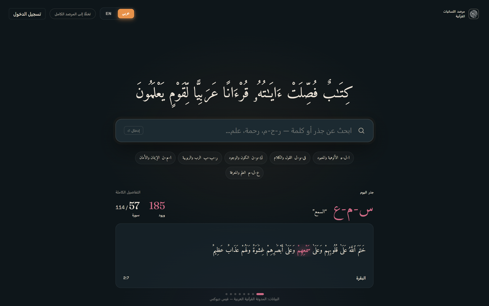

## ثالثاً: نتيجةٌ تُقرأ في لحظة

بمجرّد الكتابة يظهر العدد كبيراً واضحاً، ومعه الصورة المشكولة للكلمة، وروابط إلى المعاجم (المعاني، ومعجم الدوحة)، وأزرارٌ للانتقال: "شاهده في سياقه"، و"ادرس شبكة الجذر"، و"قارن الصيغ". وإن كان المطلوب كلمةً بعينها بُدئ بعرض الكلمة لا الجذر، لأنه أقرب إلى مقصود الباحث.

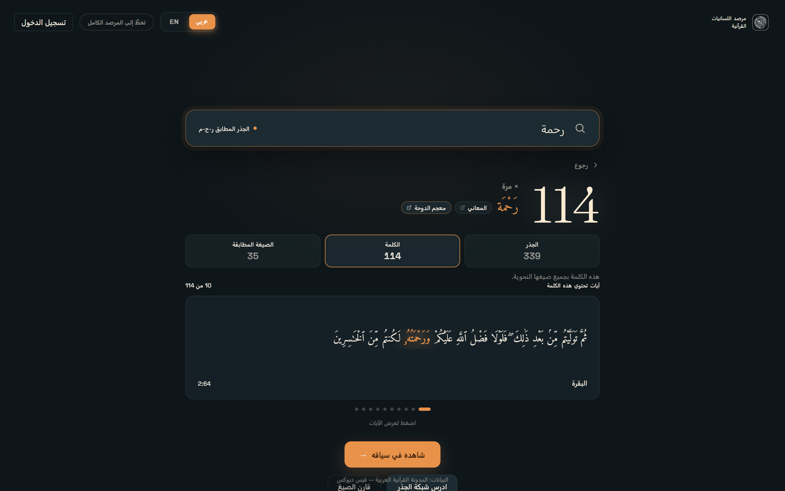

## رابعاً: التنقيب على ثلاث درجات — الجذر ← الكلمة ← الصيغة المطابقة

هذا من أهمّ ما استُحدث: العدد الواحد لم يعد مبهماً. فـ"رحمة" جذرها (ر‑ح‑م) يرد ٣٣٩ مرّة، والكلمة بجميع صيغها النحوية ١١٤، والصيغة المطابقة ٣٥ لا غير. وفي درجة الجذر يُعرض انتشاره: ٦٢ سورة من ١١٤، و٣١٣ آية مختلفة، و٩ صيغ، وأوّل ورودٍ له، مع شريطٍ بيانيٍّ للسور الأربع عشرة بعد المئة وأعلى خمسٍ منها.

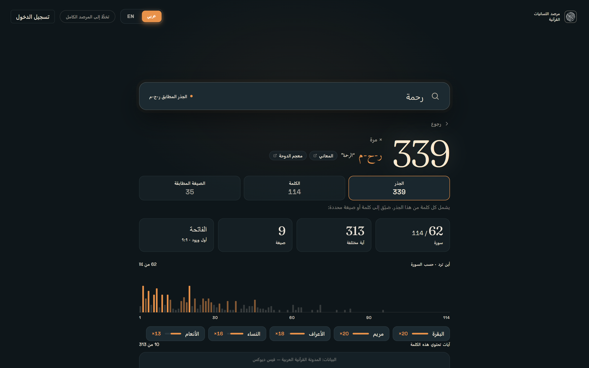

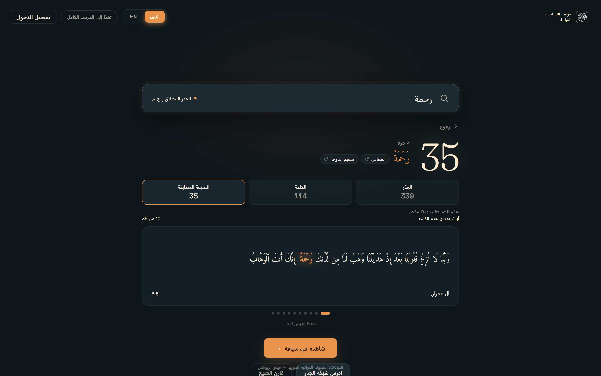

## خامساً: الآيات في سياقها

صار مع كلّ نتيجةٍ شريطٌ من الآيات التي وردت فيها الكلمة، مع تظليل الكلمة نفسها في متن الآية لا ما شابهها، ومع مراعاة الكلمات المركّبة التي تعدّها المدونة كلمتين. والنقر على آيةٍ ينقلك إلى موضعها في السورة الدائرية مركَّزاً عليها.

## سادساً: الإملاء الحديث والرسم العثماني

كان الباحث بالإملاء المعاصر لا يجد شيئاً؛ لأنّ متن المدونة على الرسم العثماني، ولأنّ جذورها تُكتب بالألف المجرّدة. فأُصلح ذلك على ثلاثة وجوه: الألف المحذوفة في الرسم (صالح/صلح)، والهمزة في الجذور (ءمن/امن)، والمدّة في مثل "قرآن" التي يكتبها المتن "قُرْءَان". فصار يُعثر على المطلوب سواء كُتب: قرآن، أو قران، أو قرءان، أو قرأن، أو كُتب بحروف لاتينية quran.

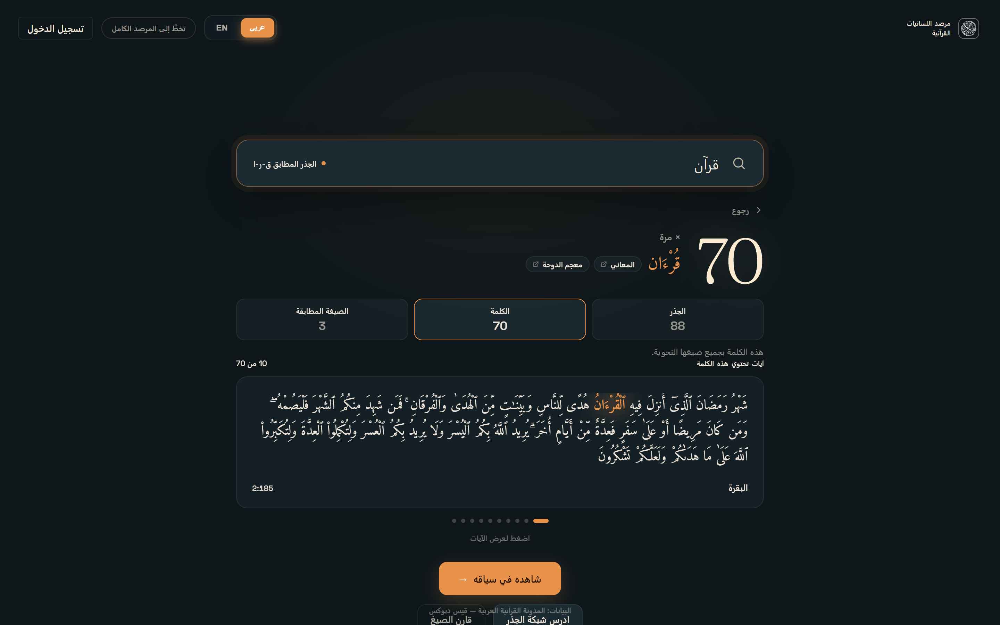

## سابعاً: الأعلام والأسماء

الأعلام في المدونة لا جذور لها، فكانت تسقط من البحث والعدّ جميعاً. صارت الآن مفهرسةً معدودة، مع قبول اختلاف الرسم (إسماعيل/اسماعيل)، والأسماء المركّبة، والمطابقة الجزئية؛ فيكفي أن تكتب "اسماع" ليُعرض عليك "إسماعيل".

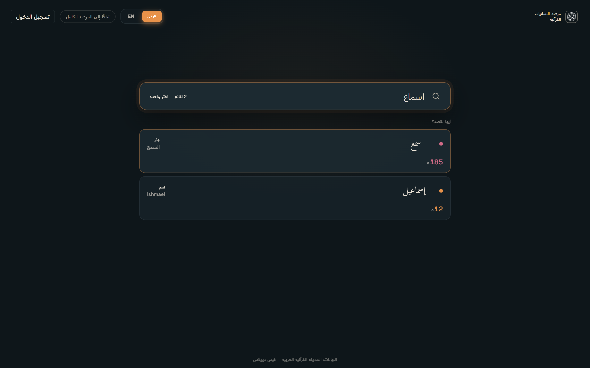

## ثامناً: رفع اللبس

إن احتمل المكتوب وجهين عُرضا معاً مع بيان نوع كلٍّ منهما وعدده، فـ"اسم" يحتمل الجذر (سمو) بـ٣٨١ ورودًا، ويحتمل العلم "إسماعيل" بـ١٢. وكذلك تُردّ الكلمة المصرَّفة إلى جذرها بدل أن تُرَدّ خائبة.

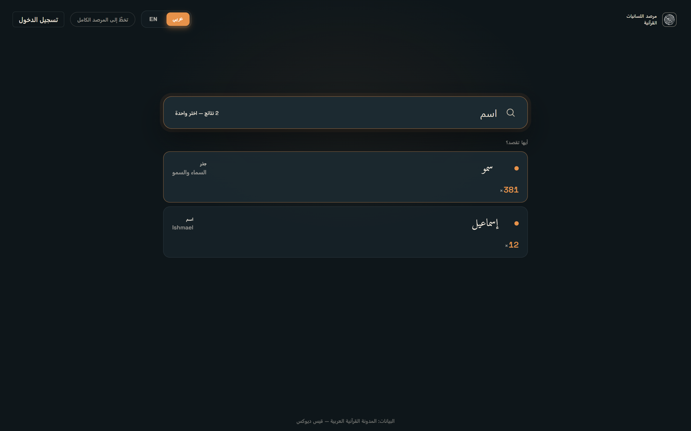

## تاسعاً: المرصد نفسه — قراءةٌ أيسر

- السورة الدائرية: تظهر أرقام الآيات وجذورها وروابطها عند تكبيرٍ أخفّ من ذي قبل، وصارت خيوط الروابط قابلةً للنقر عند أيّ درجة تكبير.
- شبكة التلازم والانسياب: تفتح على الجذر المقصود مباشرةً إذا جاء في الرابط.
- الأرصفة الجانبية تُفتح عند الدخول لا بعد بحثٍ عنها، ومقابض الطيّ وأزرار التكبير رُدّت إلى حوافّها الصحيحة في الاتجاهين.

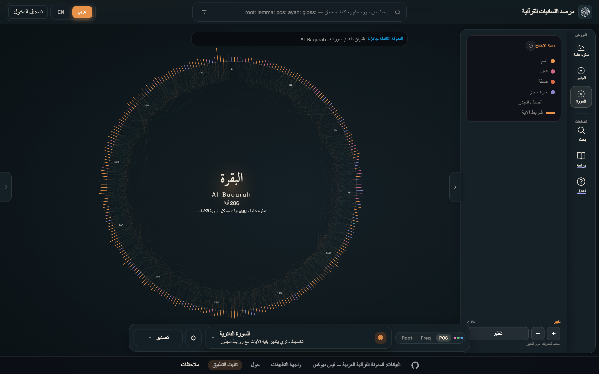

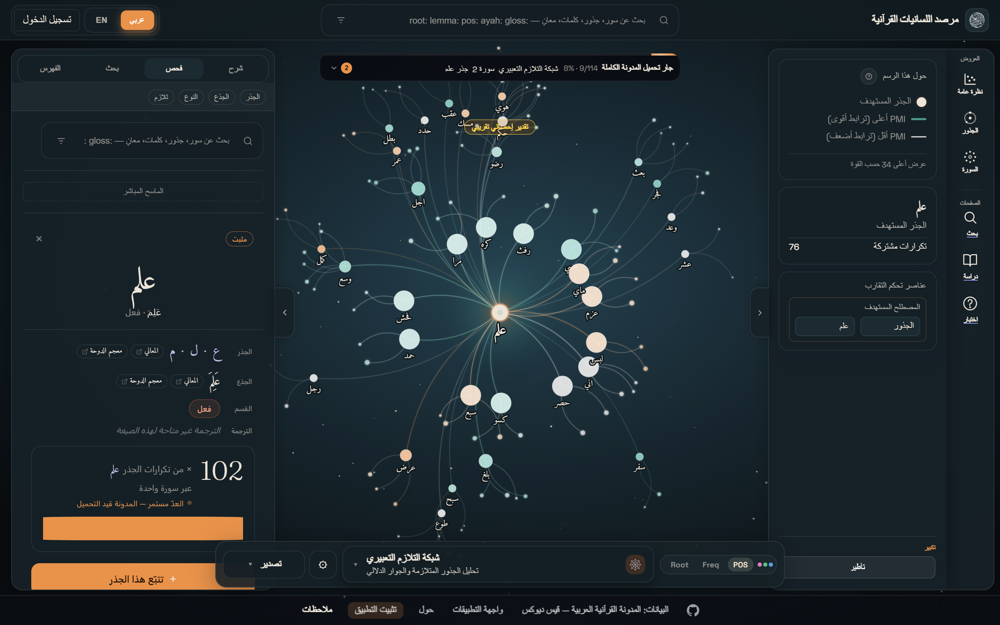

## عاشراً: لوحة الفحص

كانت بطاقة الكلمة تُصدَّر بالرسم المشكول فيصعب تبيّن الجذر؛ فصُدِّرت بالجذر مقروءاً مفكوكاً، ومعه الجذع والقسم وروابط المعاجم وعدد وروده وانتشاره في السور.

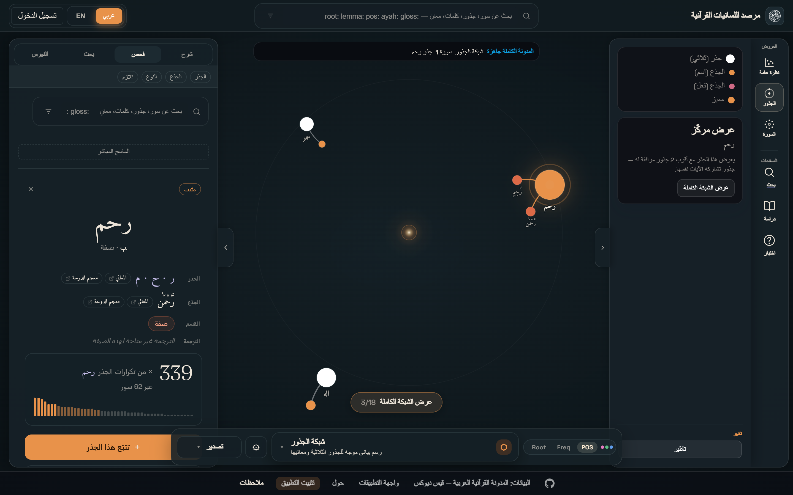

## حادي عشر: مساحة البحث

ملفّ الجذر صار مُصفَّحاً (pagination) بدل أن يُقتطع، وفهرس المدونة يُصفَّى بالسورة والجذر والجذع، وأُضيف ملفٌّ للسورة يبيّن ممّ تتألّف: جذورها وجذوعها.

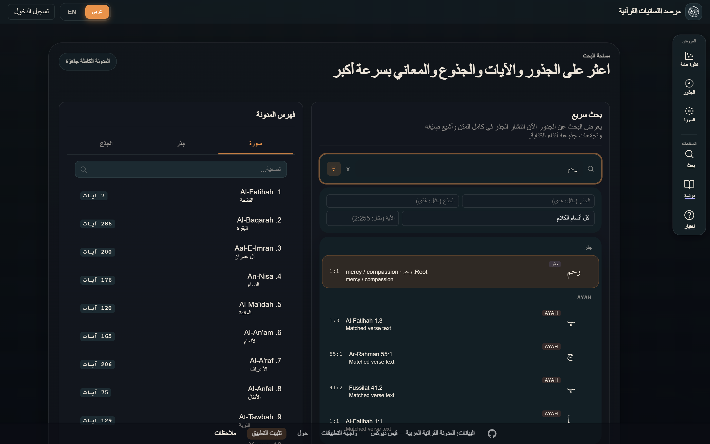

## ثاني عشر: الجوال والاتجاه من اليمين

أُعيد بناء واجهة الجوال: شريطٌ واحدٌ عائم أسفل الشاشة يجمع أدوات الرسوم، والإعدادات في قائمة، والبحث في وسط الرأس؛ وأُصلحت مواضع تصادم العناصر عند عرض ٣٩٠ بكسل، ودُقّق عرض النصوص والاتجاه في الواجهة العربية.

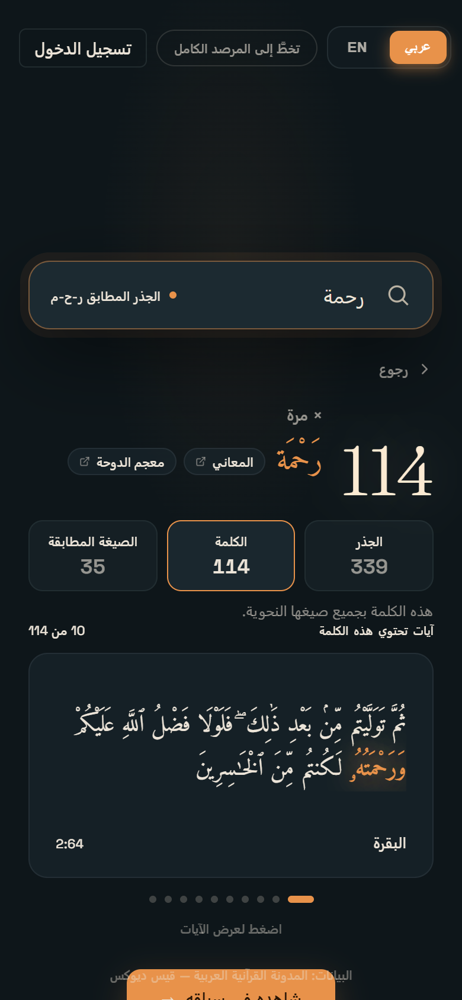

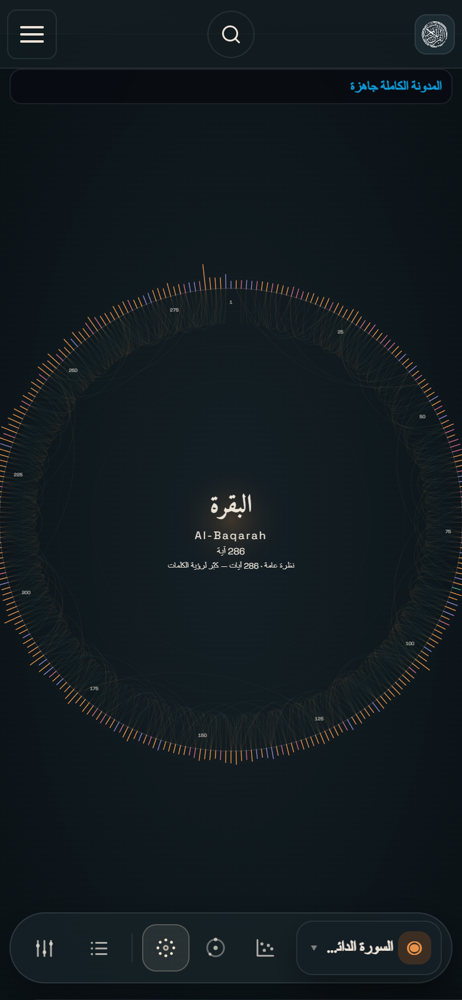

## ثالث عشر: الحساب والمزامنة

أُضيف الدخول عبر Google إلى جانب البريد، وصُحّح مسار العودة بعده، وصارت رسائل البريد باسم المشروع وهويّته، وللحساب بطاقة تعريفٍ في صفحته.

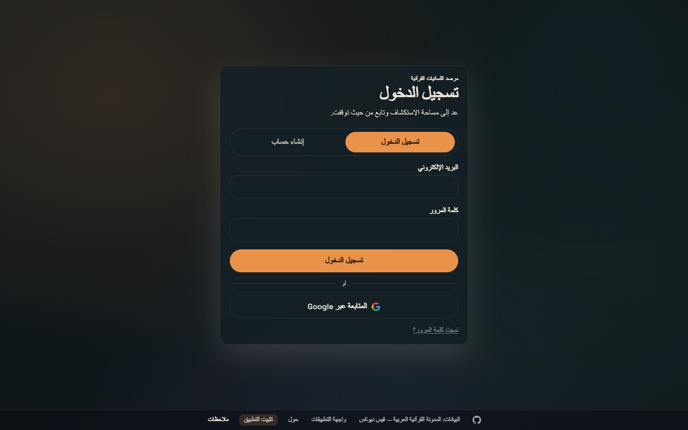

## رابع عشر: المصطلح والنسبة والأمان

- ضُبط المصطلح في الواجهة العربية، فاستُعمل "لساني" موضع "لغوي" في مواضع الاصطلاح، و"الصيغة المطابقة" اسماً للدرجة الثالثة من التنقيب.
- نسبة البيانات إلى **المدونة القرآنية العربية — قيس ديوكس** ثابتةٌ في تذييل كلّ صفحة.
- عولجت ثغرات الاعتماديات المبلَّغ عنها، وأُصلح عاملُ الخدمة (service worker) الذي كان يُعطَّل فيمنع التثبيت على الأجهزة.

## خامس عشر: ممّا هو في الطريق

العمل جارٍ على ضمّ المعاجم إلى المرصد — المعجم الاشتقاقي المؤصّل لمحمد حسن جبل، والمعجم المفهرس — وما يستلزمه ذلك من تدريب نموذجٍ للتعرّف الضوئي على الحروف العربية في المصوّرات؛ وهو بعدُ لم يُنشر.

---

**البيانات:** المدونة القرآنية العربية لقيس ديوكس [corpus.quran.com](https://corpus.quran.com)، وواجهة [quran.com](https://api-docs.quran.com/).
